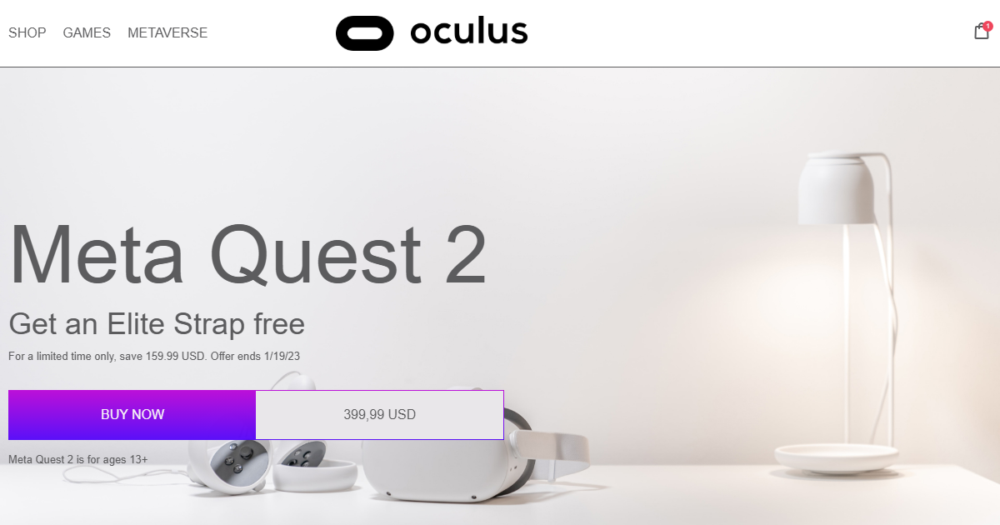

# Oculus

A responsive landing page for the Meta Quest 2 VR headset, built as a learning project
around CSS Grid and CSS animations. No frameworks, no build step — plain HTML, CSS and
vanilla JavaScript.

**Live demo:** https://tecna-developer.github.io/oculus/



## Highlights

- **CSS Grid throughout** — the navbar, the feature tabs, the games row, the "In the box"
  mosaic and the accessories row are each laid out with Grid rather than floats or
  positioning.
- **Seven breakpoints** (1140, 990, 880, 820, 768, 568, 420px), including a slide-in burger
  menu on narrow screens. Measured: no horizontal overflow on phones (375–768px) or on
  desktop (≥1140px). See Known issues for the widths where that is not yet true.
- **Dark theme** driven by `prefers-color-scheme`. Custom properties are split into a fixed
  palette and semantic roles (`--bg-color`, `--text-color`, `--heading-color`,
  `--line-color`), so switching themes means overriding four variables rather than hunting
  down individual rules.
- **CSS animations** — `slideFromRight` drifts the oversized "oculus" watermark across the
  hero, `metaversePulse` pulses the metaverse call-to-action without ever shrinking below
  its resting size.
- **Accessible tabs** — a proper `tablist` / `tab` / `tabpanel` structure with
  `aria-selected`, roving `tabindex`, and arrow / `Home` / `End` keyboard navigation.
- **Gradient text and borders** via `background-clip: text` and `border-image`.
- **Self-hosted Helvetica** in woff2 with `font-display: swap`.

## Running it

The page has no dependencies, so opening the file directly works:

```bash
git clone https://github.com/tecna-developer/oculus.git
```

Then open `index.html` in a browser.

Fonts and images load fine over `file://`, but if you would rather serve it over HTTP:

```bash
python -m http.server 8000
```

## Structure

```
index.html        markup for the whole page
css/style.css     all styles: variables, layout, animations, media queries
js/main.js        burger menu toggle, the tab switcher, the video modal and the
                  metaverse GO button's loading sequence
fonts/            Helvetica woff2 (regular and bold)
icons/            UI icons (logo, cart, play) — the social icons are now inlined
                  as SVG markup in index.html
images/           product photography and section backgrounds
```

Class names follow a BEM-like convention. Sizing is in `rem` with `html { font-size: 62.5% }`,
so `1rem` equals 10px.

## Scope

This is a front-end exercise, so the page is presentation only — there is no backend behind
it. The newsletter form validates the email and submits, but nothing receives it; the
"BUY NOW" and cart buttons are styled targets without handlers. The play buttons open a
video modal, and the metaverse GO button plays a fake loading sequence, but neither talks
to a backend. Each of the six feature tabs has its own copy and its own image.

## Known issues

The page still scrolls sideways in two places. Measured in a browser, not estimated:

| Viewport | Horizontal overflow |
|---|---|
| ≥1140px | 0 |
| 1000px | 114px |
| 900px | 214px |
| 820px | 62px |
| 375–768px | 0 |
| 320px | 15px |

The tablet band between roughly 820 and 1140px is the bad one. Above 820px the burger menu
is hidden and `.menu` returns to the flow, and something in that row sizes to its content
rather than to the available width — the hero heading then fills the widened container
rather than causing it. The root cause is not isolated yet; a plausible-looking fix to
`.nav`'s grid tracks was tried and measured to change nothing, so it was not kept.

The 15px at 320px is a separate, smaller problem.

Both are worth a proper investigation rather than a guess. `overflow-x: hidden` on the body
would hide the symptom and is not the fix.
